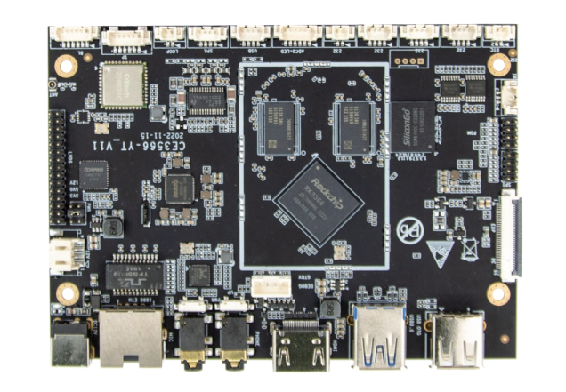
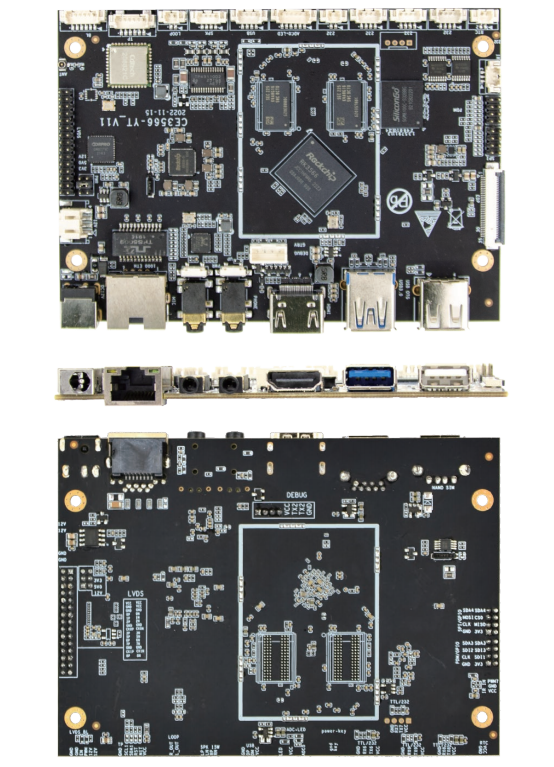
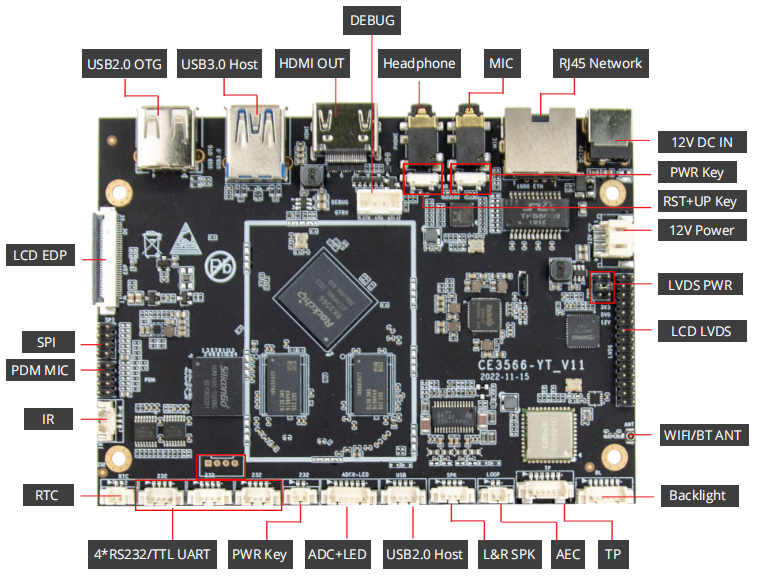

# DEBIX R3566-01 Single Board Computer
 

## Overview
The DEBIX R3566-01 is a cost-effective, commercial-grade, single-board computer based on the Rockchip RK3566, which focuses on power consumption control and cost-effectiveness. It provides rich I/O interfaces for flexible application in various fields such as AIoT devices, smart home products, and electronic ink screen devices.

## Specification
| System          |                                                                         |
|-----------------|-------------------------------------------------------------------------|
| CPU             | Rockchip RK3566, 4 x Cortex-A55 1.8GHz, comes with an integrated neural processing unit (NPU) that delivers up to 1.0 TOPS.  |
| Memory          | 1\) Default: 2GB LPDDR4 (4GB/8GB optional) 2\) 2GB/4GB/8GB LPDDR4X optional   |
| Storage         | 16GB eMMC (8GB/32GB/64GB/128GB/256GB optional)                          |
| OS              | Android, Yocto, Debian                                                  |
|**Communnication**|                                                                      
| Gigabit Network | 1 x Gigabit Ethernet                                                    |
| WiFi & BT       | 2.4GHz & 5GHz Wi-Fi4/5, BT 5.0 (optional)                               |
|**Video & Audio**|                                                                      
| LVDS            | 1 x LVDS, supports single and dual 8bit 1 x LVDS backlight, supports backlight control adjustment 1 x LVDS Power  |
| TP              | 1 x TP, supports I2C or USB protocol                                    |
| eDP             | 1 x eDP                                                                 |
| HDMI            | 1 x HDMI output with Type-A HDMI female                                 |
| SPK             | 1 x L&R SPK, 4Ω/2W                                                      |
| Headphone       | 1 x Headphone                                                           |
| MIC             | 1 x MIC                                                                 |
| PDM             | 1 x PDM MIC                                                             |
| AEC             | 1 x AEC loopback                                                        |
|**Other Interfaces**|
| UART            | 3 x UART (RS232/TTL) 1 x UART (RS232/TTL) (reserved)                 |
| USB 2.0         | 1 x USB 2.0 OTG 1 x USB 2.0 Host                                     |
| USB 3.0         | 1 x USB 3.0 Host                                                        |
| SPI             | 1 x SPI                                                                 |
| IR              | 1 x IR receiver interface                                               |
| ADC & LED       | 1 x ADC signal acquisition and LED control interface                    |
| Debug           | 1 x Debug                                                               |
| Power           | 1 x DC IN                                                               |
| RTC             | 1 x RTC battery interface                                               |
| key             | 1 x PWR 1 x PWR Key 1 x RST+UP Key                                |
|**Power Supply**|
| Power Input     | DC 12V-24V/2A input                                                     |
|**Mechanical & Environmental**|
| Size            | 123.0mm × 88.0mm x 1.20mm (±0.5mm)                                      |
| Operating Temp. | 0°C to 70°C                                                            |
| Net Weight      | 49g (±0.5g)                                                             |

## I/O Interfaces:

## Compatible with DEBIX's Accessories:
| Product                     | Model               |
|-----------------------------|---------------------|
| DEBIX Display Screen        | DEBIX TD050A; DEBIX TD070A; DEBIX TD101A; DEBIX TD050H; DEBIX TD070H; DEBIX TD101H |

## Safety Instructions and Warnings:
**General:**
- Avoid exposure to water, moisture and conductive surfaces while operating.
- Handle with care to avoid mechanical or electrical damage to the circuit board and connectors.
- Only handle the board by the edges when powered on to minimize the risk of electrostatic discharge damage.

**Power:**
- Use only a 12V/2A DC minimum external power supply that complies with relevant regulations and standards for your country.

**Environment:**
- Operate in a well-ventilated environment, even if using a case.
- Place on a stable, flat, non-conductive surface and avoid contact with conductive items.

**Connections:**
- Use peripherals that comply with relevant standards for the country of use and ensure proper insulation and operation.

**Additional notes:**
- This summary is not exhaustive, please refer to the full User Manual for details.
- If you are unsure about any aspect of safety or operation, consult a qualified
professional.

## Contact Us
- **Headquarters**: DEBIX Technology Inc., 8345 Gold River Ct., Las Vegas, NV 89113, USA  
- **Factory**: 5-6/F., East Zone, Shunheda A2 Building, Liqxiandong Industrial Park, XiLi, Nanshan Dist., Shenzhen, China  
- **Email**: info@debix.io  
- **Website**: [www.debix.io](https://www.debix.io)  
- **Community**: [Discord](https://discord.com/invite/adaHHaDkH2)